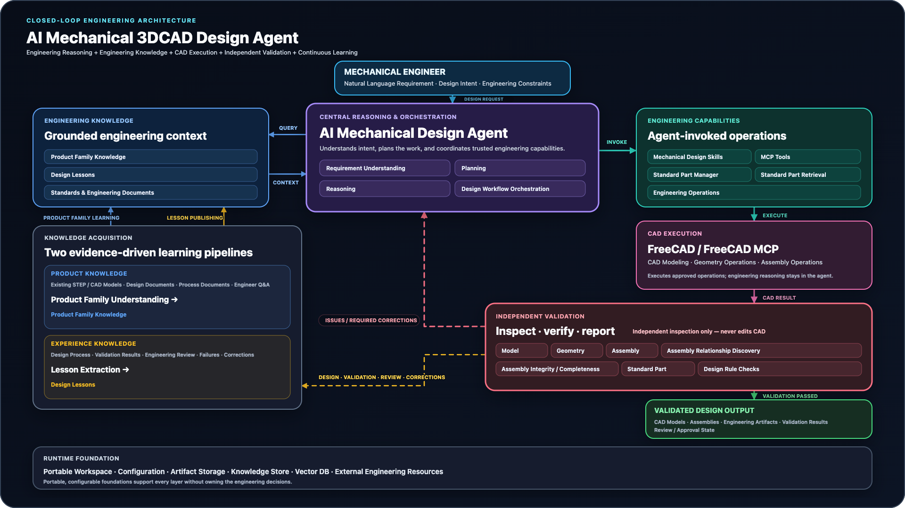

# AI Mechanical 3DCAD Design Agent


AI Mechanical 3DCAD Design Agent provides deterministic mechanical 3D CAD
workflows, engineering knowledge, validation, and MCP tools for a coding agent
or another compatible MCP client. The core package does not include an embedded
language-model client. Standalone LLM orchestration is not included in version
0.5.0.

The public Python distribution is `ai-mechanical-3dcad-design-agent`. Existing
compatibility surfaces remain stable: the Python package is
`mechanical_design_agent`, the CLI is `mechanical-design`, and the MCP server is
`mechanical-design-mcp`.

## Release boundary

Version 0.5.0 is being simplified around the default lightweight workflow
described below while preserving explicit governed compatibility.

The default workflow is a lightweight AI mechanical-design experimentation
path: one natural-language design approval, optional knowledge retrieval,
direct FreeCAD modeling, exact-hash validation, automatic correction, and
result recording in local filesystem state. PostgreSQL-backed Design Jobs,
Change Sets, Approval Envelopes, mutation authorization, obligations, and
delivery approval remain available only through the explicit `governed`
compatibility profile. The distribution retains Product Family Knowledge,
Design Lessons, standard-part provenance, validation resources, safe
FreeCADCmd execution, and package-owned database migrations. It does not
bundle a language model, CAD model library, generated design output, database
services, or a FreeCAD GUI MCP integration.

See [Architecture](docs/ARCHITECTURE.md) for trust boundaries and the
[Design Job workspace guide](docs/DESIGN_JOB_WORKSPACES.md) for routing,
directory, migration, and recovery contracts. The
[Engineer learning playbook](docs/ENGINEER_LEARNING_PLAYBOOK.md) describes the
operational knowledge workflow. A supported local and evaluation database path
is documented in [Database deployment](docs/DATABASE_DEPLOYMENT.md). The public
[environment template](.env.example) and
[synthetic product-family example](examples/product_families/example-family.json)
contain no production credentials or real project data.

## Capabilities

- Explicit, idempotent workspace initialization with structured diagnostics.
- Filesystem-backed `designs/<design-id>/` sessions with no database dependency.
- Natural Chinese and English `APPROVE` / `REJECT` / `UNCLEAR` semantics.
- Empty-workspace first use and explicit product-family creation/selection.
- FreeCADCmd extraction and package-owned FreeCAD scripts for applicable
  headless workflows.
- PostgreSQL/pgvector authoritative storage and a rebuildable Neo4j projection.
- Scoped `DesignContext/v2` retrieval, auditable learning, and design lessons.
- Provider-aware standard-part lookup and provenance.
- FreeCAD model, mechanical-interface, and `AssemblyCompleteness/v2` validation.
- Stable CLI and MCP tool schemas for coding agents and compatible MCP clients.
- Best-effort knowledge retrieval that does not block ordinary CAD when no
  match exists or the optional backend is unavailable.
- Task-focused MCP profiles that reduce model-visible tool choice while the
  complete compatibility surface remains available.

## Agent instructions and skills

The repository root [`AGENTS.md`](AGENTS.md) defines the recommended operating
boundary for coding agents. Three project-owned skills are included:

- [`mechanical-design-job-workspace`](.agents/skills/mechanical-design-job-workspace/SKILL.md)
  operates the optional governed compatibility workflow only. Ordinary CAD does
  not use this skill or create a Design Job.

- [`freecad-standard-parts`](.agents/skills/freecad-standard-parts/SKILL.md)
  selects and imports reusable standard mechanical components while preserving
  catalog provenance and BOM metadata.
- [`freecad-model-validation`](.agents/skills/freecad-model-validation/SKILL.md)
  validates FCStd and STEP geometry, same-revision evidence, standard-part
  provenance, and mandatory fastener installation contracts.

These skills are source-controlled project capabilities. They do not install
themselves into a user's global agent environment.

### Optional: Superpowers brainstorming

The external [`superpowers:brainstorming`](https://github.com/obra/superpowers)
skill is recommended for turning an incomplete mechanical-design request into
reviewable requirements before modeling. It is optional, not bundled, not
installed, and not required by this project.

- **Codex App:** open **Plugins**, find **Superpowers** in the Coding category,
  and choose **Install**.
- **Codex CLI:** run `/plugins`, search for `superpowers`, and select
  **Install Plugin**.

See [Optional agent workflows](docs/OPTIONAL_AGENT_WORKFLOWS.md) for the scope,
installation boundary, and fallback behavior.

## Architecture



## FreeCAD integration boundary

A compatible external FreeCAD GUI MCP integration is required for the
recommended interactive FreeCAD workflow. It is not bundled with the core
Python distribution. Interactive viewing, selection, measurement, modeling,
and modification inside the FreeCAD GUI depend on that external integration.

Bootstrap, configuration, knowledge, database, standard-part, and applicable
headless/FreeCADCmd capabilities can operate without the GUI MCP. This project
does not vendor or relicense an external FreeCAD GUI MCP.

See the [FreeCAD GUI MCP integration boundary](docs/FREECAD_GUI_MCP_INTEGRATION.md)
for the exact validated upstream identity, installation boundary, localhost
security contract, and release acceptance matrix.

The previously recorded Windows integration boundary is Windows 11 x64,
CPython 3.12, FreeCAD 1.1.3 x64, and the exact external MCP commit recorded
above. The v0.3 Design Job live workflow requires a new protected-host run
before release certification. See the
[Windows release acceptance](docs/WINDOWS_RELEASE_ACCEPTANCE.md) guide for the
fixed-NTFS, second-volume, wheel-first, protected-host, and portable ZIP
limitations. No other Windows, Python, FreeCAD, architecture, or MCP version is
implied.

## Install

Python 3.12 or newer is required.

```bash
python -m pip install ai-mechanical-3dcad-design-agent
```

## Initialize a workspace

The CLI uses an explicit workspace. Initialization creates only managed
configuration and artifact directories; a new workspace contains zero product
families.

```bash
mechanical-design init --workspace /path/to/mechanical-design-workspace
```

PowerShell uses the same CLI contract and native path syntax:

```powershell
mechanical-design init --workspace C:\path\to\mechanical-design-workspace
$env:MECH_DESIGN_WORKSPACE = "C:\path\to\mechanical-design-workspace"
```

These path examples describe the portable configuration contract. Windows
certification is limited to the exact boundary in the Windows release guide.

## Optional: create and select a product family

A Product Family is not required for an ordinary Design Job. Establish the
organization and design-group scope independently when initializing a new
workspace:

```bash
mechanical-design init \
  --workspace /path/to/mechanical-design-workspace \
  --organization-id example-org \
  --design-group-id example-design-group
```

Create a family only when the design belongs to a reusable governed family:

```bash
mechanical-design family create \
  --workspace /path/to/mechanical-design-workspace \
  --organization-id example-org \
  --organization-name "Example Organization" \
  --design-group-id example-design-group \
  --design-group-name "Example Design Group" \
  --family-id example-family \
  --family-name "Example Product Family" \
  --set-default
```

The checked-in synthetic JSON is documentation only. It is never copied,
auto-discovered, selected, or loaded as a runtime default.

At request intake, `product_family_inventory` reads authorized discovery
metadata from PostgreSQL and `product_family_match` records the match decision.
An exact existing binding or approved identifier may authorize the family;
descriptor-only candidates require user confirmation, and no credible match
continues with a null family. `workspace_product_family_list` reports bootstrap
JSON configuration only and is not the authoritative family inventory.

## Lightweight design sessions

Ordinary designs use `designs/<design-id>/design.json` and `model.FCStd` inside
the selected workspace. `design_start` creates or idempotently resumes the
session after one approval. Existing source CAD is snapshotted read-only.
`design_record_result` marks completion only when the validation report and
Markdown/PNG evidence match the exact current FCStd SHA-256.

## Optional governed Design Jobs and legacy migration

Design Jobs are retained for users who explicitly select the `governed`
profile for audit-heavy or multi-user work. They are not prerequisites for an
ordinary design and existing Job data is not migrated or deleted by the
lightweight workflow.

Upgrading a workspace that contains pre-Job working copies is an explicit,
receipt-bound operation. First save the UTF-8 JSON dry-run output:

```bash
mechanical-design job migrate-legacy --dry-run --workspace /path/to/mechanical-design-workspace
```

Review that plan and its `receipt_sha256`, then apply the exact saved plan:

```bash
mechanical-design job migrate-legacy --apply \
  --workspace /path/to/mechanical-design-workspace \
  --plan-file /path/to/legacy-plan.json \
  --receipt-sha256 <receipt-sha256> \
  --confirmation "迁移旧设计 <receipt-sha256>"
```

Migration creates one independent Legacy Job per old working copy, verifies the
FCStd bytes and hashes, retains the original file, and writes an immutable
receipt in the new Job. It never guesses that two old designs should be merged.
Repeated apply is idempotent; a changed source or plan is rejected. `job doctor`
reports unmigrated, incomplete, and hash-divergent Legacy bindings.

The complete new/resume/independent decision matrix, portable directory
contract, macOS and PowerShell examples, Product Family and Design Lesson
provenance rules, compatibility window, and recovery codes are documented in
[Design Job workspaces](docs/DESIGN_JOB_WORKSPACES.md).

## Status, diagnostics, and smoke validation

```bash
mechanical-design status --workspace /path/to/mechanical-design-workspace
mechanical-design doctor --workspace /path/to/mechanical-design-workspace
mechanical-design smoke-fixture --workspace /path/to/mechanical-design-workspace --source /path/to/model.FCStd
```

`status` and `doctor` report the four-state diagnostic model: `ok`, `warning`,
`setup_required`, and `blocked`. Operational commands fail closed with a
structured setup/configuration response when their required capability is not
ready.

## Start the MCP server

Select the workspace explicitly or with the modern environment setting:

```bash
MECH_DESIGN_WORKSPACE=/path/to/mechanical-design-workspace \
MECH_DESIGN_MCP_TOOL_PROFILE=design \
mechanical-design-mcp
```

The MCP server exposes deterministic tools; semantic reasoning remains the
responsibility of the connected coding agent or MCP client.

`design` is the default profile and exposes seven tools: system status,
`design_start`, optional `design_knowledge_retrieve`, `design_record_result`,
and the applicable standard-part tools. `governed` exposes the historical Job,
change, approval, validation-record, and delivery lifecycle. `family-knowledge`
focuses on Product Family onboarding and knowledge curation; `maintenance`
exposes owner operations; and explicit `all` exposes the compatibility union.
An unknown profile fails closed at startup.

## Configurable runtime capabilities

PostgreSQL/pgvector and Neo4j are supported configurable runtime capabilities.
The installed package owns and loads their schema migrations. The public
`compose.yaml` can provision loopback-only services for local and evaluation
use; run it with an explicit protected env file, then run
`mechanical-design database bootstrap` from the installed wheel. See the
[database deployment guide](docs/DATABASE_DEPLOYMENT.md) for the exact
`docker compose` flow, image digests, persistence, cleanup, and platform
boundaries.

This Compose path is not a production deployment. It does not define remote
access, production secrets, backups, high availability, monitoring, or a
managed database service. Job-CAD execution requires the exact official
FreeCADCmd 1.1.3 executable plus an explicitly reviewed
`MECH_DESIGN_FREECADCMD_SHA256`; discovery never substitutes version text for
that pinned executable identity and digest.

## Design and knowledge workflow

The ordinary flow is:

```text
request -> clarification -> short proposal -> one approval
-> optional scoped knowledge -> CAD -> validation -> automatic correction
-> design_record_result -> final result
```

`design_knowledge_retrieve` returns `DesignContext/v2` when the durable backend
is available. Matches may improve the design; no match or an unavailable
backend records a warning and continues unless the user explicitly required
that named knowledge. Specialized family knowledge still requires authority;
similarity never grants scope.

Design Lesson publication is a separate, optional durable workflow:

```text
validated design -> design_lesson_review_context
-> material/generalizable summary when warranted
-> design_lesson_review_prepare -> one immutable review card
-> display the complete card -> engineer says "确认发布设计经验" once
-> published after storage, projection, and retrieval verification
```

The agent calls `design_lesson_review_publish` with the internal Review ID; the
engineer never copies it. A durable `publishing` result is retried through
`design_lesson_review_status(retry=True)` without another confirmation. If no
candidate survives engineering review, the agent displays the immutable
screening card and `确认无可发布设计经验` records
`reviewed-no-publishable-lesson` without creating shared knowledge. Model
confirmation remains separate and never publishes a Lesson. The hash-bound
`design_lesson_stage`,
`design_lesson_staged_get`, `design_lesson_approve`, and
`design_lesson_supersede` surfaces remain an expert/audit compatibility path.

Completion uses mandatory exact-hash validation. FreeCAD model validation emits the
model-detected fastener inventory bound to the same-revision FCStd SHA-256.
`AssemblyCompleteness/v2` requires exactly-once fastened-joint assignment for
every occurrence. Missing, duplicate, unknown, failed, or stale evidence is a
mandatory model and assembly failure. `AssemblyCompleteness/v1` is rejected.

## License boundary

Project-owned source code is released under Apache License 2.0. Dependencies,
external integrations, vendored components, submodules, and assets retain their
own licenses and are not relicensed by this project. The machine-readable
inventory is rendered into the public [Third-Party Notices](THIRD_PARTY_NOTICES.md);
an entry in that index does not relicense a third-party component or CAD asset.
