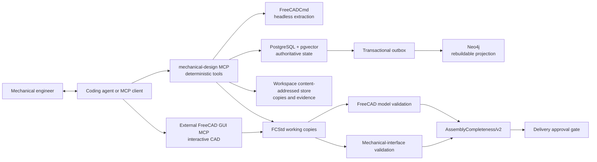

# Architecture and trust boundaries



The core service does not call a language-model API. It validates structured
requests, extracts geometry, stores audit state, retrieves approved knowledge,
and projects relationships. Semantic reasoning belongs to the connected coding
agent or MCP client.

The certified Windows integration boundary is Windows 11 x64 with CPython
3.12, FreeCAD 1.1.3 x64, and the exact external MCP commit documented in
[Windows release acceptance](WINDOWS_RELEASE_ACCEPTANCE.md). Protected release
acceptance requires two distinct fixed local NTFS volumes; public CI covers
only the non-interactive boundary.

A compatible external FreeCAD GUI MCP is required for the recommended
interactive workflow: viewing, selection, measurement, modeling, and
modification in the FreeCAD GUI. It is not part of the Python distribution.
Bootstrap, configuration, knowledge, database, standard-part, and applicable
headless FreeCADCmd capabilities do not require that GUI integration.

## Portable workspace boundary

The installed package contains immutable code and package-owned resources; it
is never a writable configuration location. An explicitly selected workspace
owns `config/mechanical_design.json`, product-family configuration,
standard-part source bindings, and the artifact root. Package defaults are
values, not paths into the package filesystem.

Workspace initialization is explicit and idempotent. A newly initialized
workspace may contain zero product families. Operational commands report
`setup_required` until the required family is created and explicitly selected.
Runtime configuration precedence is final override, process environment,
workspace manifest, then package default. Explicit env-file compatibility is
parsed into an isolated mapping and never mutates the process environment.

## Authoritative state

PostgreSQL owns identity, model revisions, source hashes, extracted manifests,
geometry/structure vectors, questions, engineer answers, assertion versions,
reviews, family profiles, design changes, lesson events, and validation reports.
pgvector stores deterministic geometry and structure descriptors, not semantic
embeddings produced by a hidden model.

Neo4j is a disposable relationship projection. Transactional outbox events
project approved state, and `projection_rebuild` can reconstruct the graph from
PostgreSQL. Graph unavailability never broadens scope or makes Neo4j
authoritative.

Database services are configurable runtime capabilities. The installed package
owns PostgreSQL and Neo4j migration resources. The public Compose file may
provision loopback-only PostgreSQL/pgvector and Neo4j services for local and
evaluation use, but it never owns, mounts, or executes migrations. The
installed package owns PostgreSQL and Neo4j migration resources and the
installed `mechanical-design database bootstrap` command applies and verifies
them. Production provisioning remains outside the version 0.1.0 boundary. See
[Database deployment](DATABASE_DEPLOYMENT.md).

## Model analysis and working copies

FreeCADCmd extracts geometry and structure without modifying source CAD.
Manifests record bounding boxes, volume, area, center of mass, inertia basis,
surface and hole-axis candidates, definitions and occurrences, fragments,
repeated shapes, and spatial/interface candidates. Approximate mesh-derived
properties are labeled with their deterministic basis and deflection rather
than presented as exact material mass properties.

An existing STEP/FCStd model must resolve one unique
`source_model_revision_id` before a working copy is created. New designs may
start from a neutral source-less FCStd seed. Working-copy mutations are
serialized by a workspace-owned lock, and important records bind the current
FCStd SHA-256. Before FreeCAD opens a governed FCStd, the Agent inspects its
ZIP/XML structure without executing document objects and rejects encrypted,
ambiguous, oversized, or path-unsafe archives. Scripted FreeCAD documents,
including `App::FeaturePython`, Python proxies, and Python-object properties,
are intentionally unsupported by the governed working-copy boundary.

## Design-context gate

`DesignContext/v2` is the sole context contract. Specialized family/design
group knowledge enters it only after explicit family authorization, confirmed
current-model family, or explicit session selection. Without authority,
`specialized_knowledge` is empty and the client asks for function, loads,
envelope, interfaces, and constraints in neutral terms.

Similarity never grants scope. Pending, rejected, superseded, conflicting, or
out-of-scope assertions cannot support a design change. Neo4j relationships are
queried only after the family gate has resolved; PostgreSQL remains the
authoritative fallback.

## Knowledge and design lessons

Engineer answers are stored verbatim and the coding agent's interpretation is a
separate auditable field. Assertions are atomic, evidence-bound, reviewed, and
retrievable only when approved. Organization-general promotion does not grant
access to specialized family terminology or parameter ranges.

The default post-delivery lesson path is:

```text
design outcome -> design_lesson_review_context
-> one immutable review card -> engineer approval
-> PostgreSQL + outbox -> Neo4j -> retrieval verification
```

The local expert/audit staging path validates `DesignLessonPackage/v1`,
canonicalizes JSON, hashes workspace-relative evidence, and writes a review
package atomically. Staging does not publish. Approval re-verifies the immutable
package, evidence, source revision, authorization, and current FCStd hash before
the PostgreSQL transaction. Supersession and revocation retain audit history and
update the graph through the outbox.

## Standard-part acquisition

The deterministic provider registry is consulted before custom geometry.
Providers retain their own identity, license, source URL, part number,
designation, nominal size, checksum, and validation evidence. Browser login and
download remain operator-visible; the core service does not store website
credentials or silently use the network.

An external catalog is bound only by an explicit configuration command and must
already exist. Incoming parts remain quarantined until used, checked, and
explicitly approved for reuse. Promoted parts use a checksum-addressed
`<catalog>/<provider>/<manufacturer>/<category>/<part>/<sha256>` layout.

## Mandatory design-delivery gates

FreeCAD model validation and declared mechanical-interface validation run on
the current FCStd revision. The model gate emits a model-detected fastener
inventory bound to the same-revision FCStd SHA-256. Interface validation covers
declared datum-axis concentricity, mating contact, and component clearances.

`AssemblyCompleteness/v2` consumes that evidence immediately before delivery.
It requires exactly-once fastened-joint assignment for every detected fastener,
BOM coverage, grounded graph connectivity, functional load paths, moving-part
clearance evidence, and explicit external-interface ownership. Missing,
duplicate, unknown, failed, or stale evidence is a mandatory model and assembly
failure. `AssemblyCompleteness/v1` is rejected because joint-level evidence
cannot prove per-occurrence coverage.

These deterministic checks establish evidence and workflow state; they do not
claim engineering certification, strength, manufacturability, or standards
compliance beyond the checks that actually ran.
