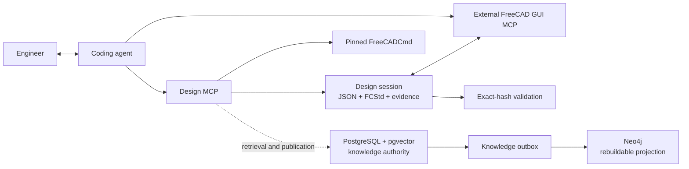

# Architecture and trust boundaries



The coding agent interprets requirements and prepares Design Lesson candidates.
The package validates structured operations, files, hashes, decisions, and
knowledge records. It does not call a language-model API.

## Design sessions

Each design owns one directory:

```text
designs/<design-id>/
├── design.json
├── model.FCStd
├── source/          # optional read-only source snapshot
├── validation/
├── output/
└── lesson-review/   # created only when material lessons exist
```

`DesignSession/v1` separates model status, direction approval, final
confirmation, and lesson review. Updates are atomic and lock-protected.

One direction approval authorizes CAD work and validation-driven correction
inside the agreed design. Final confirmation requires a completed FCStd whose
current SHA-256 matches the recorded model and passed validation report, plus
existing Markdown and PNG evidence.

A later FCStd byte change invalidates final confirmation and any pending lesson
review. Knowledge outages never invalidate an unchanged completed model.

## Knowledge

Knowledge retrieval is best effort. `completed_matches`,
`completed_no_match`, and `unavailable` are valid outcomes. Only an explicitly
required named source can make retrieval blocking.

PostgreSQL stores:

- organization and design-group scope;
- Product Families and approved assertions;
- immutable Design Lesson review decisions and published lessons;
- search text, vector fields, applicability, authorization, and provenance;
- transactional outbox and projection state.

It stores no design-session or CAD-edit state. A previous database layout is
not modified automatically; initialize a new knowledge database when the
bootstrap diagnostic requests it.

Neo4j contains only a rebuildable relationship view. Projection failure leaves
PostgreSQL authoritative and the outbox event pending.

## Design Lessons

Final-model confirmation immediately evaluates structured candidates derived
by the agent from the design history, model, validation evidence, corrections,
standard-part evidence, and manufacturing notes.

A candidate must identify a reusable problem, decision, evidence,
applicability, prevention action, and search terms. Private, customer-specific,
project-only, unsupported, or non-reusable candidates are excluded.

When nothing material remains, the design finishes. Otherwise the package
writes one immutable `DesignLessonReviewCard/v1` and returns it for display.
One subsequent natural-language decision publishes or declines the complete
card. Publication is idempotent by review-card SHA-256.

## FreeCAD and file safety

Existing source CAD is snapshotted read-only. Only the session `model.FCStd` is
edited. Before FreeCAD opens an FCStd, ZIP/XML inspection rejects encrypted,
ambiguous, oversized, path-unsafe, or scripted documents. FreeCADCmd must match
its configured file identity, version, and SHA-256 around every invocation.

Secure filesystem adapters cover atomic creation and replacement, path
containment, symlink or reparse-point rejection, exclusive locks, Unicode,
spaces, Windows path spelling, and cleanup of owned temporary data.

## Validation and standard parts

Completion requires machine-readable JSON, human-readable Markdown, and visual
PNG evidence for the exact FCStd hash. Assembly validation checks detected
fastener inventory, joint assignment, BOM coverage, connectivity, load paths,
motion clearance evidence, and external interfaces when applicable.

Standard components preserve provider, manufacturer, standard, part number,
nominal size, source URL, local path, validation report, metadata, and SHA-256.
The configured external catalog is checksum-addressed and remains separate
from generated design artifacts.

These checks provide evidence, not strength analysis, manufacturing release,
or safety certification.
